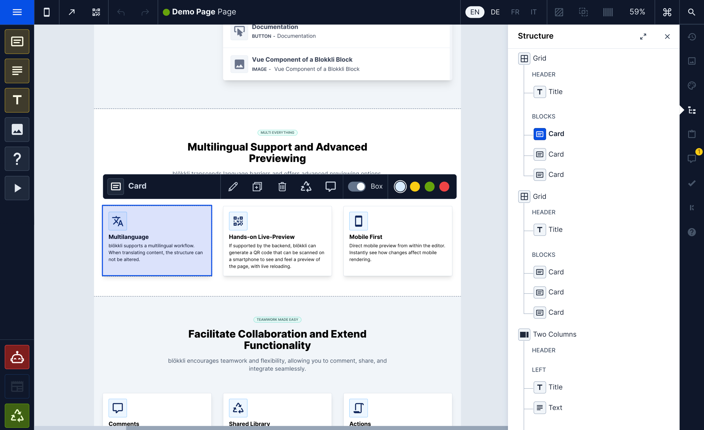

# blökkli page builder for Nuxt

**[Live Demo](https://blokk.li)**

blökkli is an interactive page editor that integrates with any backend and
offers various features to edit content quick and easy.

## Features

- Smooth drag and drop editing
- True WYSIWYG
- Dynamic options for block apperance
- Inline text editing (plain or rich text)
- Multilanguage (both UI and content)
- Nested blocks (for sections, grids, accordions, etc.)
- Restrictions (allowed block types, cardinality, max instances)
- Clipboard integration (paste text, images, links or copy blocks)
- Comments
- and many more

## Comparison to other editors

The main difference to other WYSIWYG editors is that blökkli does not manage the
data - it's just the editor. It provides a single interface (called adapter) to
integrate any backend or data structure. Actually performing the mutations (like
add, delete, move, setting options) is left to the adapter. In most cases an
adapter method performs API calls, but it could as well all be done in the
browser. In fact, the demo page / playground implements a reference adapter that
stores mutations in local storage and keeps data in JSON files.

## Integration with Nuxt

One of the main goals of blökkli is to offer a seamless integration with your
new or existing Nuxt app. Creating new block components is straightforward.
Options to change the appearance of a block are directly defined in the
component, so is configuration that defines the behaviour of the block when
rendered in the editor.

During normal rendering of blocks (not in the editor), the provided blökkli
components and composables have a minimal overhead, to not have a negative
impact on performance.

## Backends

Currently blökkli ships with an adapter to integrate it with the paragraphs
module of Drupal. The
[Paragraphs blökkli](https://www.drupal.org/project/paragraphs_blokkli) module
implements all features available in the editor. It provides a new edit state
entity that stores the applied mutations and implements a GraphQL schema
extension to integrate the adapter.

## Acknowledgments

blökkli was developed by [dulnan](https://github.com/dulnan) at
[Liip](https://www.liip.ch/). The development was supported by the canton of
Basel-Stadt in Switzerland as part of the relaunch project for WebBS.
